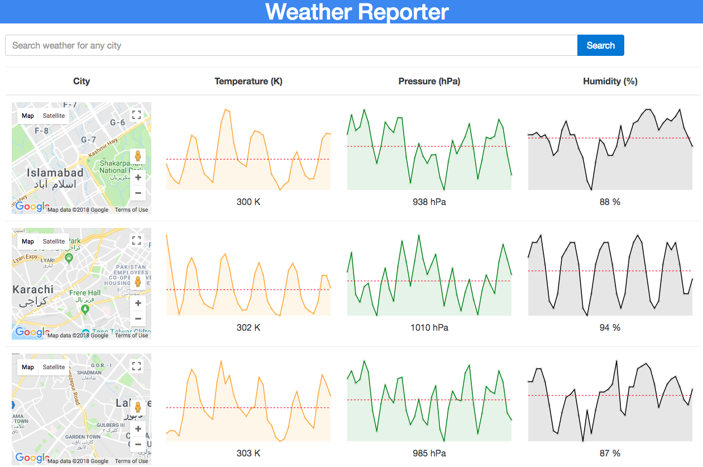

# WeatherReporter-ReactJS
> Weather Reporter developed using developed using ReactJS and Redux.

[![License][license-image]][license-url]

Weather Reporter is a weather reporting tool which uses openweathermap API to show 5 day weather forecasts of your desired cities in Pakistan (You can change the country by editing the country code). Weather reporter also displays the humidity and pressure of your desired cities and plots graphs to give you an idea of highs and lows of the weather.

## Features

- [x] Search weather of any city.
- [x] Display's average temperature, pressure and humidity.
- [x] Display's 5 day forecast graphs of temperature, pressure and humidity.

## Requirements

- NodeJS
- ReactJS
- React-redux

## Installation

#### Manually
1. Clone or Download the project.
2. npm install
3. npm start
4. Go to localhost:8080/

## Contribute

We would love you for the contribution to **WeatherReporter-ReactJS**, check the ``LICENSE`` file for more info.

## Meta

Moaz Khan – moazkh60@gmail.com

Distributed under the Opensource license. See ``LICENSE`` for more information.

[https://github.com/moazkh60](https://github.com/moazkh60)

[license-image]: https://img.shields.io/badge/License-GPL%20v3-blue.svg
[license-url]: LICENSE